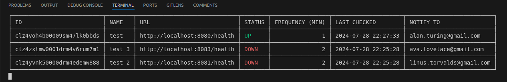
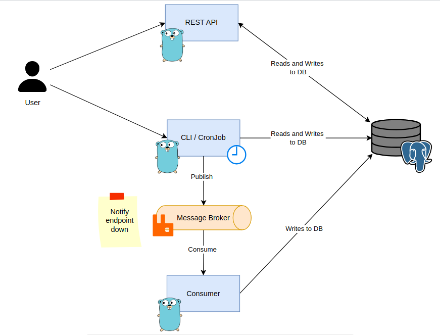

# Health Checker

Health Checker is a comprehensive application designed to monitor and manage the status of your endpoints. It is divided into three main components: API, CLI, and a Consumer.

## Showcase



## Architecture Diagran



## How to run

1. Prepare the environment

```bash
docker-compose up -d
```

2. Run all applications

```bash
go run cmd/api/main.go
```

```bash
go run cmd/cli/main.go
```

```bash
go run cmd/consumer/main.go
```

## Components

### API

The API component is responsible for retrieving and adding new endpoints to the system. It provides endpoints for developers to interact with the application programmatically.

### CLI

The CLI (Command Line Interface) component allows users to visualize the existing endpoints and their status. It provides a user-friendly interface for users to interact with the application without the need for programming knowledge.

### Consumer

The Consumer component is responsible for notifying users whenever an endpoint is down. It continuously checks the status of the endpoints and sends notifications to the appropriate users when an endpoint becomes unavailable.

## Consumer Payload

The payload for the application is a JSON object containing the following fields:

```json
// QUEUE: notify.endpoint.down
{
  "endpoint_id": "clz4sbuhy0000m5hi0sre6alg",
  "destination": "alan.turing@gmail.com"
}
```

The `endpoint_id` field is a unique identifier for the endpoint, while the `destination` field is the email address where notifications will be sent when the endpoint becomes unavailable.

## Usage

To use the Health Checker application, you can interact with the API using your preferred programming language or use the CLI to visualize the existing endpoints and their status. The Consumer component will automatically notify users when an endpoint becomes unavailable.
